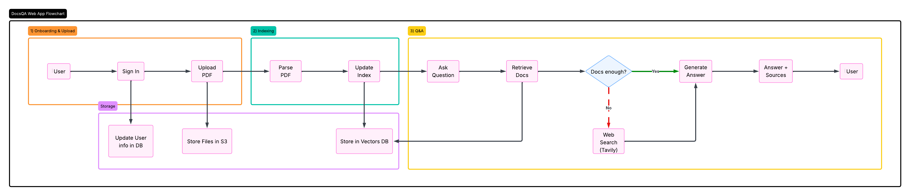

# DocsQA Smart Research Assistant

This is my take-home submission for the ABSTRABIT AI/ML Engineer assignment: a RAG-powered assistant where users upload PDFs, ask questions, and get grounded answers with citations.

## Live Project

- Live app (Railway): `https://docsbot-web-production.up.railway.app`
- GitHub: `https://github.com/KBaba7/DocsBot`
- Loom walkthrough: _add your link here_

## What I Built

The app supports authentication, PDF upload (up to 5 files and 10 pages per file), document chunking + vector indexing, and a chat experience that answers from uploaded documents first.  
If the uploaded documents are not enough, the agent falls back to web search and cites those sources too.

## Stack

- FastAPI + SQLAlchemy
- LangGraph agent
- Groq chat model
- Jina embeddings + Jina reranker
- Supabase Postgres + `pgvector`
- Railway deployment

## Workflow


## How Retrieval Works

Uploaded PDFs are parsed page by page and split into chunks.  
Each chunk is stored with metadata (document, page number, chunk index) and embedded into `pgvector`.

At question time:
1. LLM-based document filtering selects relevant documents from user's library
2. Vector search retrieves relevant chunks from selected documents
3. Jina reranking reorders the retrieved chunks for better final relevance
4. The agent answers from those chunks when possible
5. If evidence is weak, the agent uses web search and cites external URLs

## Chunking Strategy

- Splitter: LangChain `RecursiveCharacterTextSplitter`
- Chunk size: `1000`
- Overlap: `150`

Why this setup:
- It prefers breaking on paragraphs and sentence boundaries before falling back to smaller separators.
- It preserves more coherent chunks for contracts, specs, and structured PDFs.
- A smaller overlap keeps recall while reducing duplicated context in retrieval.

## Retrieval Approach

I use cosine similarity search in `pgvector`, then apply Jina reranking for better final ordering.  
The system uses an LLM-based retrieval planner to choose:

- the final number of chunks to keep
- the candidate pool to rerank

Those values are clamped to safe bounds before retrieval runs.

The UI shows:

- document name
- page number
- chunk excerpt

for retrieved document sources.

## Agent Routing Logic

The agent is prompted to prefer document context first.

- If retrieved document context is sufficient: answer from documents with citations.
- If not sufficient: clearly say docs are insufficient and use web search tool.

This is implemented as tool-based behavior in LangGraph rather than a static fallback message.

## Source Citations

Each turn stores/returns source metadata separately from the answer body.

- Vector source cards include:
  - document name
  - page number
  - snippet (short snippet from retrieved chunk)
- Web source cards include:
  - title
  - URL

## Conversation Memory

Conversation history is maintained within session scope, so follow-ups like “tell me more about that” work as expected.
The frontend also preserves the visible chat thread per session, so upload-triggered page refreshes do not wipe the current conversation view.

## Streaming UX

Answers are streamed into the chat UI progressively.

- the visible response is rendered chunk by chunk
- source cards are attached after the answer completes
- a slight pacing delay is added so the stream feels live to the user

The streaming route is separate from the standard JSON `/ask` response path.

## Bonus Feature

I added hash-based deduplicated ingestion:

- If the same PDF is uploaded again, processing/indexing is reused.
- Access control is still user-scoped via ownership mapping.

Why I chose this:
- saves compute/time,
- avoids duplicate indexing,
- keeps retrieval secure per user.

I also implemented LLM-based document filtering:

- The system sends all user documents (filename, summary, preview) to the LLM
- LLM semantically analyzes and selects only truly relevant documents for the query
- Returns a JSON array of relevant file hashes
- It is not forced to return a capped number of documents
- Fallback returns all candidate document hashes if the LLM call fails

## Challenges I Ran Into

1. Heavy embedding dependencies made deployment images too large.
   - I standardized on Jina API embeddings/reranking to keep the runtime lighter while preserving retrieval quality.
2. Source rendering got messy across multiple chat turns.
   - I separated answer text from source payloads and extracted sources per turn.
3. Intermittent DB DNS/pooler issues during deployment.
   - I improved connection handling and standardized Supabase transaction-pooler config.
4. UI state was getting lost after document uploads.
   - I persisted the active chat thread in session storage so the current conversation remains visible after refresh.

## If I Had More Time

- Add conversation history UI to display past chat sessions
- Add automated citation-faithfulness checks
- Add Alembic migrations for cleaner schema evolution
- Add stronger eval/observability for routing and retrieval quality

## Local Setup

```bash
cp .env.example .env
python3 -m venv .venv
source .venv/bin/activate
pip install -e .
uvicorn app.main:app --reload
```

Open: `http://127.0.0.1:8000`

## Important Environment Variables

Required:
- `GROQ_API_KEY`
- `SECRET_KEY`
- `DATABASE_URL`
- `JINA_API_KEY`

Embeddings:
- `JINA_API_BASE` (default: `https://api.jina.ai/v1/embeddings`)
- `JINA_EMBEDDING_MODEL` (default: `jina-embeddings-v3`)
- `JINA_RERANKER_API_BASE` (default: `https://api.jina.ai/v1/rerank`)
- `JINA_RERANKER_MODEL` (default: `jina-reranker-v3`)
- `EMBEDDING_DIMENSIONS` (default: `1024`)
- `RETRIEVAL_K` (default minimum final context size: `4`)
- `RERANK_CANDIDATE_K` (default minimum rerank candidate pool: `12`)

Storage:
- `STORAGE_BACKEND=local|supabase`
- `SUPABASE_URL`
- `SUPABASE_SERVICE_ROLE_KEY`
- `SUPABASE_STORAGE_BUCKET`
- `SUPABASE_STORAGE_PREFIX`

Web search:
- `WEB_SEARCH_PROVIDER=duckduckgo|tavily`
- `TAVILY_API_KEY` (if using Tavily)

Auth:
- `ACCESS_TOKEN_EXPIRE_MINUTES` (default: `720`)
- For local development, lowering this can make login/logout testing easier

## API Endpoints

- `POST /register`
- `POST /login`
- `POST /logout`
- `POST /upload`
- `GET /documents`
- `DELETE /documents/{document_id}`
- `GET /documents/{document_id}/pdf`
- `POST /ask`
- `POST /ask/stream`

## Sample Documents

As requested in the assignment, sample PDFs are included in `test_documents/`.

## Railway Deployment

```bash
railway login
railway link
railway up
```

Set the same env vars in Railway service settings before deploying.
